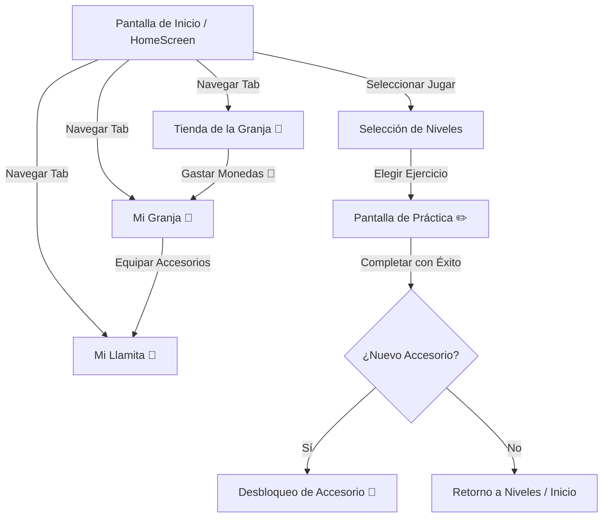

# 🦙 Manual de Usuario: MateAndina

Bienvenido a **MateAndina**, una aplicación móvil educativa interactiva diseñada para ayudar a niños y estudiantes a comprender las matemáticas y el orden de jerarquía de las operaciones aritméticas combinadas mediante una metodología paso a paso y un motivador sistema de gamificación andino.

---

## 📋 Índice
1. [Introducción y Objetivos](#1-introducción-y-objetivos)
2. [Requisitos del Sistema e Instalación](#2-requisitos-del-sistema-e-instalación)
3. [Flujo de Navegación de la Aplicación](#3-flujo-de-navegación-de-la-aplicación)
4. [Guía de Uso: Pantalla de Práctica (Gameplay Core)](#4-guía-de-uso-pantalla-de-práctica-gameplay-core)
5. [Sistema de Recompensas y Gamificación](#5-sistema-de-recompensas-y-gamificación)
6. [Preguntas Frecuentes (FAQ) y Resolución de Problemas](#6-preguntas-frecuentes-faq-y-resolución-de-problemas)

---

## 1. Introducción y Objetivos

El objetivo principal de **MateAndina** es guiar al estudiante a través de la resolución de expresiones aritméticas complejas. A diferencia de las calculadoras tradicionales que solo dan el resultado final, MateAndina entrena el cerebro del niño para:
*   Identificar los **signos separadores de bloques** (`+` y `-`).
*   Determinar la **jerarquía de las operaciones** (resolver primero paréntesis, luego potencias/raíces, multiplicaciones/divisiones, y finalmente sumas/restas).
*   Visualizar y resolver **paso a paso** cada sub-operación en un cuaderno digital cuadriculado interactivo.

---

## 2. Requisitos del Sistema e Instalación

### Requisitos Mínimos:
*   **Dispositivo**: Teléfono inteligente o tableta con Android 6.0 (API 23) o superior.
*   **Espacio en Disco**: Mínimo 100 MB libres.
*   **Conexión a Internet**: **No requerida**. MateAndina se ejecuta de manera 100% offline para resguardar la privacidad del menor y permitir el estudio en cualquier lugar.

### Instrucciones de Instalación:
1.  Descarga el archivo APK de distribución: [app-release.apk](file:///C:/Users/jaime/.gemini/antigravity/brain/40e1df5f-fc9d-4afc-b3af-f87c17cda417/app-release.apk).
2.  Transfiere el APK a tu dispositivo Android (o descárgalo directamente en él).
3.  Abre el gestor de archivos de tu dispositivo y toca el archivo `app-release.apk`.
4.  Si el sistema lo solicita, habilita la opción de **Instalar aplicaciones de fuentes desconocidas** en la configuración de seguridad de tu navegador o gestor de archivos.
5.  Sigue los pasos en pantalla para completar la instalación y haz clic en "Abrir" para iniciar la aventura matemática.

---

## 3. Flujo de Navegación de la Aplicación

La navegación dentro de MateAndina está diseñada para ser intuitiva y circular. A continuación se presenta el flujo de pantallas:

---

## 4. Guía de Uso: Pantalla de Práctica (Gameplay Core)

Cada ejercicio en MateAndina se divide en 4 fases secuenciales e interactivas:

### Fase 1: Identificación de Signos Separadores
La pantalla te mostrará una expresión aritmética completa. 
1.  El niño debe **tocar todos los signos de suma (`+`) o resta (`-`)** que no estén dentro de paréntesis.
2.  Estos signos dividen la expresión en bloques de operaciones independientes.
3.  Al seleccionarlos correctamente, el botón verde de verificación te permitirá avanzar.

> [!NOTE]
> Si el niño selecciona un signo incorrecto (por ejemplo, una multiplicación `*`), la aplicación le dará una pista: *«Los signos separadores de bloques son el "+" y el "-". Inténtalo de nuevo.»*

---

### Fase 2: Determinación de la Jerarquía
Una vez separados los bloques, el niño debe decidir **cuál bloque u operación se debe resolver primero** en base al orden de jerarquía matemática.
1.  La aplicación mostrará una pregunta de opción múltiple (por ejemplo: *«¿Qué operación se resuelve primero en el bloque dos?»*).
2.  El niño debe elegir la opción correcta (ej: *«La potencia $3^2$»* o *«La multiplicación»*).

---

### Fase 3: Resolución del Bloque (Cálculo)
Tras determinar qué resolver, toca calcular el resultado de esa sub-operación específica.
1.  Se presentarán opciones numéricas como respuesta.
2.  Al seleccionar la respuesta correcta, la aplicación simplificará la ecuación y guardará el avance visual en el cuaderno de trabajo.

---

### Fase 4: Progresión en el Cuaderno
A medida que se avanza en la resolución, MateAndina simula un **cuaderno de borrador cuadriculado** en la parte inferior de la pantalla:
*   Las expresiones se resuelven de manera progresiva.
*   Al cambiar de línea (por ejemplo, después de simplificar bloques principales), la app dibuja automáticamente un signo igual (`=`) y la nueva expresión reducida en la siguiente línea de la cuadrícula, permitiendo al estudiante seguir visualmente el hilo del desarrollo matemático de principio a fin.

---

## 5. Sistema de Recompensas y Gamificación

MateAndina premia el esfuerzo académico y la constancia de los estudiantes a través de dos sistemas complementarios:

### 5.1 Recompensas por Ejercicios Completados (Monedas 🌟)
Cada vez que el estudiante complete satisfactoriamente un ejercicio, recibirá:
*   **Monedas de Oro (🌟)**: Utilizadas para comprar en la Tienda de la Granja.
*   **Accesorios de Mérito Académico**: Obtenidos automáticamente al superar hitos importantes (ej. resolver el Ejercicio 1, 2, 3, 5 y 10).

| ID Hito | Nombre del Accesorio | Ícono | Descripción |
| :--- | :--- | :---: | :--- |
| Ejercicio 1 | Gorra Exploradora | 🎩 | Para el aventurero de las matemáticas. |
| Ejercicio 2 | Gafas del Sabio | 🕶️ | Ahora ves los números con más claridad. |
| Ejercicio 3 | Capa Matemática | 🦸 | El héroe de las operaciones combinadas. |
| Ejercicio 5 | Insignia Estrella | ⭐ | Completaste la mitad del currículo. |
| Ejercicio 10 | Corona de Maestro | 👑 | ¡Completaste todos los ejercicios! |

---

### 5.2 La Tienda de la Granja 🏪
En la pestaña de la **Tienda**, los niños pueden canjear sus monedas (🌟) por objetos decorativos y de cuidado para su llamita. Los objetos se dividen en 4 categorías de rareza:

| Objeto | Tipo | Costo (🌟) | Rareza | Descripción |
| :--- | :---: | :---: | :---: | :--- |
| **🧣 Poncho de Lana** | Cuerpo | 50 | Común | Te mantiene calientito mientras calculas. |
| **🧤 Guantes de Alpaca** | Brazo Izq | 60 | Común | Para escribir sumas sin frío. |
| **🧿 Amuleto de Suerte** | Brazo Der | 80 | Común | Atrae la sabiduría de los ancestros. |
| **🩴 Oshas Chaski** | Piernas | 150 | Raro | Corres por las montañas como un rayo. |
| **🧶 Chullo de Colores** | Cabeza | 200 | Raro | Gorro tejido con hilos de sabiduría. |
| **🌞 Espejo Solar** | Piel | 250 | Raro | Refleja la luz del Inti en tus ojos. |
| **👟 Pezuña de Oro** | Piernas | 400 | Épico | Avanza seguro por los senderos rocosos. |
| **👒 Sombrero de Paja** | Cabeza | 500 | Épico | Protección clásica para días soleados. |
| **🔱 Cetro del Inca** | Brazo Izq | 800 | Legendario | Poder ancestral para resolver todo. |
| **🌋 Corazón de los Andes** | Cuerpo | 1500 | Legendario | El espíritu eterno de la montaña contigo. |

---

### 5.3 Mi Granja 🏡 y Mi Llamita 🦙
En estas pantallas se puede interactuar con el avatar del personaje:
*   **Visualización**: En **Mi Granja** verás a la llamita modelando los accesorios que el niño le equipa.
*   **Gestión del Inventario**: Toca cualquier accesorio adquirido para equiparlo o desequiparlo. Solo se permite un accesorio equipado por tipo de pieza (Cabeza, Cuerpo, Piernas, etc.) al mismo tiempo.
*   **Progreso de Colección**: La pantalla **Mi Llamita** muestra una barra de progreso que indica el porcentaje de objetos adquiridos en la tienda. ¡Consigue los 10 objetos para obtener el título honorario de **Maestro de las Matemáticas**!

---

## 6. Preguntas Frecuentes (FAQ) y Resolución de Problemas

### ❓ ¿Cómo avanzo al siguiente nivel de dificultad?
Para desbloquear los niveles de dificultad (Fácil $\rightarrow$ Medio $\rightarrow$ Difícil), el alumno debe completar **todos** los ejercicios del nivel anterior. El nivel Medio se desbloquea al finalizar los 10 ejercicios del nivel Fácil, y el nivel Difícil al completar los 10 del nivel Medio.

### ❓ ¿Qué pasa si cometo un error durante un ejercicio?
La aplicación está libre de frustraciones. Si el alumno selecciona una opción errónea, se mostrará una advertencia flotante explicando con detalle el por qué del error (ej. *«El resultado de la multiplicación $3 \times 5$ es $15$.»*). Podrá intentar de nuevo inmediatamente.

### ❓ ¿Los datos de progreso se borran si cierro la aplicación?
No. Los datos de monedas, accesorios desbloqueados, niveles superados y estado actual del ejercicio se guardan localmente en el dispositivo utilizando la base de datos de alta velocidad **Hive**. Puedes cerrar la aplicación y retomar tu estudio exactamente donde lo dejaste.

---

*Desarrollado con ❤️ para la educación matemática comunitaria.*
